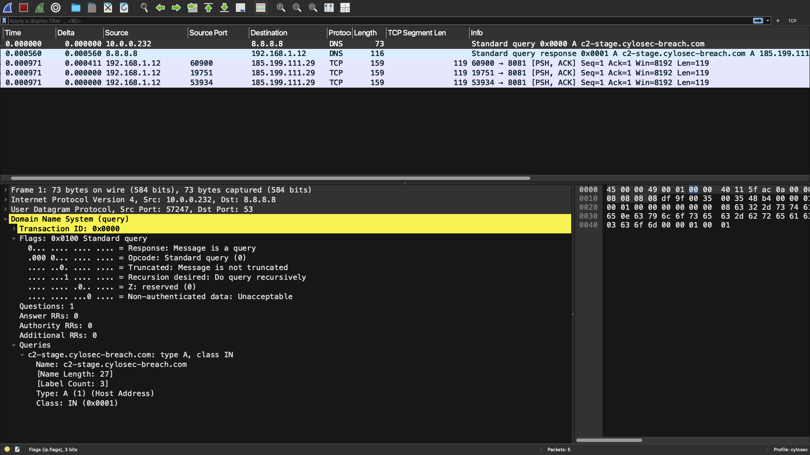
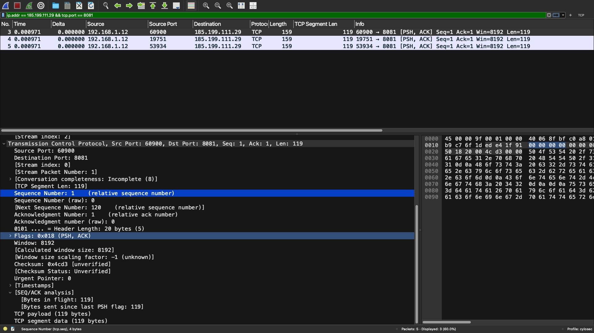
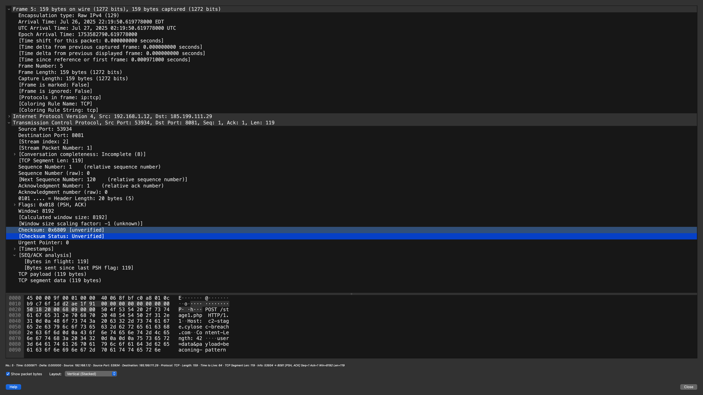

# PCAP Correlation Procedures – Wireshark Analysis

## Objective

This procedure outlines how to use Wireshark to validate the network behavior associated with lateral movement and command-and-control (C2) activity identified in alert `SIM-002-LATMOV-C2`.

---

## Step 1: Load and Inspect the PCAP

- Open `packet-capture.pcap` in Wireshark.
- Apply filters to reduce noise:
  - `ip.addr == 185.199.111.29`
  - `tcp.port == 8081`
  - `dns.qry.name == "c2-stage.cylosec-breach.com"`

---

## Step 2: Analyze DNS Resolution

### Purpose
Confirm that the internal host resolved a suspicious domain to an external IP before beaconing.

### Filter
```plaintext
dns
```

### What to Look For
- DNS query from internal host (192.168.1.12) to external resolver (e.g., 8.8.8.8)

- Query name: c2-stage.cylosec-breach.com

- DNS response contains IP 185.199.111.29


Wireshark Screenshot:



---

## Step 3: Analyze TCP Connections and HTTP Beacons
### Filter
```plaintext
ip.addr == 185.199.111.29 && tcp.port == 8081
```

### What to Look For
- HTTP POST requests from internal host to C2 server

- Regular intervals (beaconing)

- Static or repetitive payload sizes (~10KB)

- No browser user-agent (indicates non-interactive/scripted communication)

Wireshark screenshot:



## Step 4: Reconstruct TCP Stream
- Right-click a POST packet

- Select: "Follow" > "TCP Stream"

- Review encoded payloads or repeated commands

This helps verify if traffic contains staging commands or initial callbacks to a C2 server.

## Step 5: Correlate with Alert Timeline
Use timestamps from Wazuh alerts and host telemetry to match:

| Activity                     | Source                | Approx. Time (UTC)  |
| ---------------------------- | --------------------- | ------------------- |
| PowerShell launched via WMIC | Sysmon / `alert.json` | 14:28:05            |
| DNS resolution to C2 domain  | Wireshark / PCAP      | 14:29:30            |
| Beaconing to TCP 8081        | Wireshark / PCAP      | 14:30:15 and onward |


Wireshark Screenshot:



---

## Protocol Explanations
### Internet Protocol (IP)
- Layer: Network (Layer 3)

- Purpose: Routes packets between source and destination IP addresses.

- Relevance: Allows identifying source (internal) and destination (external) systems involved in C2.

## User Datagram Protocol (UDP)
- Layer: Transport (Layer 4)

- Purpose: Lightweight, connectionless protocol used for speed-sensitive services like DNS.

- Relevance: DNS queries use UDP to quickly resolve domain names before a TCP connection is made.

## Domain Name System (DNS)
- Layer: Application (Layer 7)

- Purpose: Resolves human-readable domain names (e.g., c2-stage.cylosec-breach.com) into IP addresses.

- Relevance: Attackers often use custom or fast-flux domains for C2. DNS logs or PCAPs can reveal initial resolution attempts before a connection is made.

### Outcome of Analysis
- The PCAP confirms resolution of a known malicious domain to an external C2 IP.

- HTTP POST traffic with consistent timing and structure indicates beaconing.

- No legitimate service uses TCP port 8081 from the internal host.

- This traffic matches the pattern of encoded or scripted callback sessions.

## Actionable Recommendations
- Block domain c2-stage.cylosec-breach.com and IP 185.199.111.29 at DNS and firewall layers.

- Add port 8081 to the list of monitored high-risk outbound ports.

- Tune detection rules to alert on repetitive HTTP POSTs to uncommon destinations.
